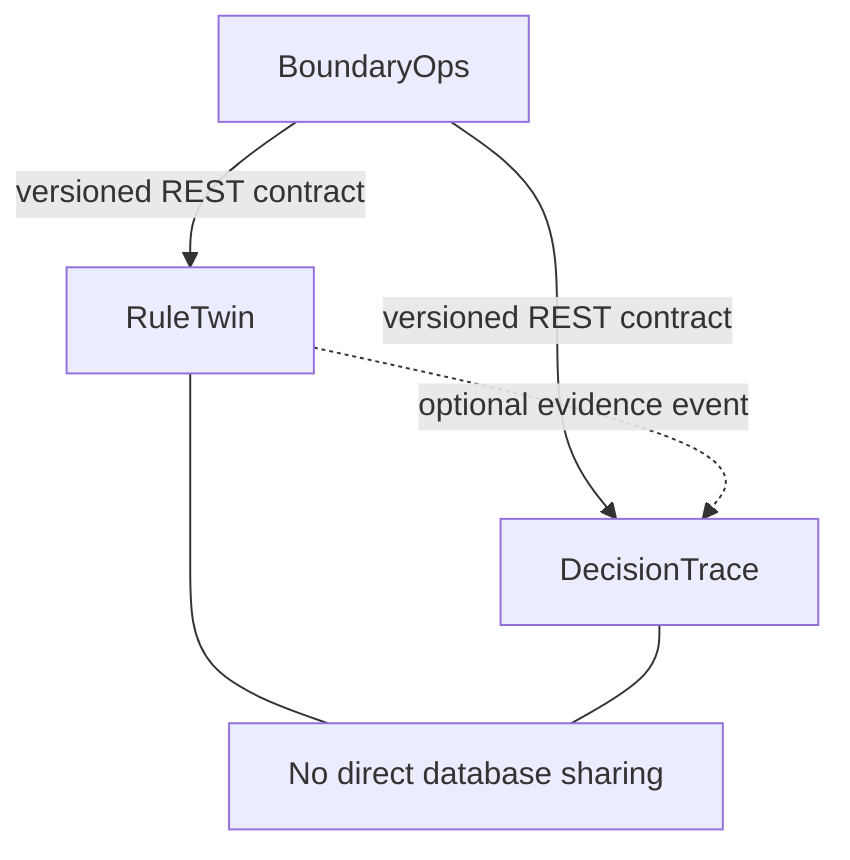

# Decision Integrity Portfolio — Engineering Handbook

## 1. Purpose

This handbook is the operating system for building, reviewing, releasing, and defending three production-grade portfolio products:

1. **RuleTwin** — deterministic tenant-level change-impact simulation.
2. **DecisionTrace** — temporal, evidence-first product-decision observability.
3. **BoundaryOps** — policy-controlled exception investigation and reversible action.

The products form one portfolio but live in separate repositories and remain separately deployable. BoundaryOps integrates through versioned APIs; it must never import internal RuleTwin or DecisionTrace code.

The engineering principle is:

> Build a narrow end-to-end slice, prove it, harden it, measure it, then expand it.

“Production ready” means the documented critical workflows meet explicit quality, security, reliability, observability, recovery, and operating gates. It does not mean zero defects. Known limitations and residual risks must be visible.

## 2. Repository model

Create four public repositories:

| Repository | Responsibility | Deployable |
|---|---|---:|
| `decision-integrity-portfolio` | Portfolio index, shared vocabulary, public roadmap, demos, cross-project scorecard | GitHub Pages only |
| `ruletwin` | Rule/configuration simulation and release assurance | Yes |
| `decisiontrace` | Temporal evidence ingestion, retrieval, verification, and drift detection | Yes |
| `boundaryops` | Governed exception investigation and bounded action | Yes |

Do not use a monorepo. Separate repositories make API ownership, dependency contracts, deployment independence, and product boundaries visible. Duplicate only small neutral items such as development scripts or documentation templates; do not create a shared runtime library until at least two consumers prove a stable need.

### Standard repository tree

```text
<repository>/
├── .github/
│   ├── ISSUE_TEMPLATE/
│   ├── pull_request_template.md
│   ├── CODEOWNERS
│   ├── dependabot.yml
│   └── workflows/
├── apps/
│   ├── api/
│   ├── web/
│   └── worker/
├── packages/
│   ├── domain/
│   ├── contracts/
│   └── test_support/
├── db/
│   ├── migrations/
│   └── seeds/
├── docs/
│   ├── product/
│   ├── architecture/
│   ├── api/
│   ├── data/
│   ├── security/
│   ├── operations/
│   ├── evaluation/
│   ├── decisions/
│   └── case-study/
├── evals/
│   ├── fixtures/
│   ├── expected/
│   └── reports/
├── infra/
│   ├── compose/
│   ├── grafana/
│   ├── prometheus/
│   └── otel/
├── scripts/
├── tests/
│   ├── contract/
│   ├── integration/
│   ├── security/
│   ├── performance/
│   └── e2e/
├── .env.example
├── CONTRIBUTING.md
├── LICENSE
├── Makefile
├── README.md
├── SECURITY.md
└── docker-compose.yml
```

If a repository has no worker or AI evaluation, omit that directory rather than leaving empty architecture.

## 3. Shared domain and dependency rules

Use synthetic contract-to-cash data only. Shared identifiers and concepts:

- tenant, user, role, contract, account;
- business event and event version;
- rule definition and rule version;
- decision contract and evidence source;
- exception case, proposed remedy, approval, action, verification;
- UTC timestamps in ISO 8601;
- opaque UUIDs at API boundaries;
- correlation ID, causation ID, actor ID, tenant ID, trace ID.

Create `docs/shared-domain-vocabulary.md` in the portfolio repository. Each product links to a versioned copy or release tag. A vocabulary change requires a cross-project impact note.

### Runtime dependency direction



Rules:

1. No cross-repository database access.
2. No copying another service's business logic.
3. OpenAPI is the source of truth for synchronous contracts.
4. JSON Schema is the source of truth for emitted events.
5. Consumers pin a compatible contract version.
6. Breaking changes require a new major version and migration window.
7. BoundaryOps must work against mocks before live integration.

## 4. Prerequisites

### Knowledge prerequisites

Before implementation, be able to explain:

- HTTP methods, status codes, pagination, idempotency, optimistic locking;
- relational modeling, indexes, transactions, isolation, migrations;
- authentication versus authorization, RBAC, tenant isolation, least privilege;
- queues, retries, exponential backoff, dead-letter handling, outbox pattern;
- unit, integration, contract, end-to-end, performance, and security tests;
- Docker images, Compose networks, environment variables, health checks;
- logs, metrics, traces, SLI, SLO, alert, runbook, RTO, and RPO;
- threat modeling, dependency risk, secrets management, data retention;
- embeddings, hybrid retrieval, reranking, grounding, evaluation, prompt injection;
- agent tool schemas, state machines, action policy, approval, rollback.

Missing knowledge is not a reason to delay all work. Learn each topic immediately before its relevant phase and record the decision it enabled.

### Local prerequisites

- Git 2.4x or newer and a GitHub account.
- Docker Desktop/Engine with Compose v2.
- Python 3.12, `uv` or Poetry, and Ruff.
- Node.js 22 LTS, `pnpm`, TypeScript, ESLint, and Prettier.
- PostgreSQL 16; pgvector for DecisionTrace.
- Ollama and the selected local model only for AI projects.
- Make or an equivalent cross-platform task runner.
- Recommended laptop baseline: 16 GB RAM, 30 GB free disk; run AI and observability profiles separately if resources are constrained.

### Repository bootstrap checklist

- Public repository created with `main` protected.
- MIT or Apache-2.0 license chosen.
- Synthetic-data and non-affiliation notice added.
- Branch deletion after merge enabled.
- Squash merge enabled; merge commits and direct pushes disabled.
- Secret scanning, dependency alerts, and automated dependency PRs enabled.
- Required status checks configured after the first workflow lands.
- Issues, milestones, labels, and a Project board created.
- No employer code, data, schema, customer name, screenshot, or proprietary rule included.

## 5. Product delivery phases

All three repositories use the same ten phase gates. Their project runbooks define the exact work.

| Phase | Outcome | Deploy? | Exit decision |
|---:|---|---:|---|
| 0 | Charter, users, problem, success metric, non-goals | No | Worth building |
| 1 | Domain, requirements, threats, NFRs, architecture decisions | No | Safe and feasible design |
| 2 | Repository, CI, local stack, health checks, skeleton | Dev | Repeatable engineering base |
| 3 | First vertical slice with one complete happy path | Dev | Core workflow is real |
| 4 | Full MVP scope and role-aware UI/API | Alpha | Target users can complete workflow |
| 5 | Failure handling, security controls, tenant isolation | Alpha | Unsafe failures are controlled |
| 6 | Evaluation, load, reliability, observability | Beta | Quality is measured |
| 7 | Release engineering, backup, restore, rollback, runbooks | RC | Operable release candidate |
| 8 | Versioned `v1.0.0` local production release | Local production | All release gates pass |
| 9 | Case study, economics, roadmap, demo, defense | Portfolio | Evidence is understandable and defensible |

Never deploy the next maturity label merely because a calendar date arrives. Promotion requires evidence.

## 6. Deployment environments

Maintain four logical environments without paid cloud services:

| Environment | Purpose | Data | Stability |
|---|---|---|---|
| `test` | CI unit/integration/contract tests | Ephemeral fixtures | Recreated per run |
| `dev` | Active feature work | Synthetic mutable seed | May reset |
| `staging` | Release candidate and integrated demos | Versioned synthetic scenario pack | Stable per release |
| `local-prod` | Tagged reproducible portfolio release | Read-only release dataset plus generated actions | Versioned and backed up |

Use Compose profiles: `core`, `observability`, `ai`, and `full`. Configuration is environment-based; secrets never enter images or Git. Each service exposes liveness and readiness independently.

### Promotion order

1. Pull request creates a temporary test stack.
2. Merge to `main` builds immutable images tagged by commit SHA.
3. Release candidate tag deploys to staging.
4. Automated smoke, migration, security, and evaluation gates run.
5. Manual release checklist approves `vX.Y.Z`.
6. The same image digest is promoted to local production.
7. Post-deploy smoke and observability checks run.
8. Failure invokes documented rollback; database rollback prefers forward-fix migrations unless a tested reverse migration is safe.

## 7. Git and pull-request workflow

Use short-lived trunk-based development with protected `main`.

### Planning hierarchy

- **Epic**: one phase or major capability.
- **Feature issue**: one user-visible vertical outcome.
- **Task**: internal work item attached to a feature.
- **Bug**: observed deviation with reproduction and severity.
- **ADR**: meaningful, hard-to-reverse technical/product decision.

### Branch names

```text
feat/RT-123-simulation-create
fix/DT-087-temporal-filter-leak
security/BO-041-tool-tenant-validation
docs/RT-015-risk-policy-adr
chore/DT-021-dependency-update
```

Do not keep long-lived `develop`, `frontend`, or `backend` branches. Integrate through small vertical PRs behind disabled feature flags when incomplete.

### Commit convention

Use Conventional Commits:

```text
feat(simulation): add idempotent create endpoint
fix(retrieval): apply authorization before candidate search
test(policy): cover replayed approval rejection
docs(adr): record relational edge decision
```

### Pull-request limits and content

- Target fewer than 400 changed code lines where practical; generated locks and fixtures excluded.
- One coherent outcome per PR.
- Include linked issue, motivation, scope, screenshots/API examples, test evidence, security impact, migration/rollback note, observability change, documentation change, and checklist.
- A PR changing a public contract must include contract tests and compatibility notes.
- A PR changing a database schema must include migration, seed compatibility, and restore/rollback evidence.
- A PR changing AI prompts/models/retrieval must include evaluation delta.
- A PR changing BoundaryOps action policy must include adversarial and unsafe-action regression results.

### Required checks

1. Formatting and lint.
2. Type checking.
3. Unit tests and minimum changed-code coverage.
4. Integration tests with real PostgreSQL.
5. OpenAPI/schema validation.
6. Contract compatibility.
7. Dependency and secret scanning.
8. Static security analysis.
9. Database migration test from previous release.
10. Relevant product evaluation regression.
11. Container build and vulnerability scan.
12. End-to-end smoke test.

As a solo developer, use a two-pass review: first as author, then after a break using the reviewer checklist. Use draft PRs early. Never self-approve by merely checking boxes; attach outputs or links.

## 8. Definition of Ready and Definition of Done

### Ready for implementation

An issue is ready only when it contains:

- user and problem;
- desired outcome and acceptance criteria;
- in-scope and out-of-scope behavior;
- affected roles/tenants/data;
- failure and abuse cases;
- dependency and contract impact;
- metric or evidence expected;
- test notes and rollout approach;
- unresolved questions explicitly assigned.

### Done for a feature

- Acceptance criteria pass.
- Tests exist at appropriate layers.
- Authorization and tenant scope are tested.
- Errors use the standard contract and do not leak sensitive details.
- Logs, metrics, and traces are sufficient to diagnose failure.
- API and user documentation are updated.
- Migration and rollback implications are addressed.
- Threat model and risk register are updated if exposure changed.
- No critical/high unresolved security finding.
- Feature works from a clean clone using documented commands.
- Evidence is attached to the PR.

## 9. Architecture and code-quality rules

Use a modular monolith for each product until measured constraints require extraction.

### Backend boundaries

```text
api -> application -> domain
infrastructure -> application/domain via interfaces
domain -> no web, database, queue, model, or vendor dependency
```

- Domain invariants live in domain code, not route handlers.
- Routes translate transport to application commands/queries.
- Repositories hide persistence; transactions are explicit at use-case boundaries.
- Background jobs call the same application services as HTTP flows.
- External clients use timeout, circuit-breaking policy, and typed responses.
- Error codes are stable and machine-readable.

### Frontend rules

- Organize by product feature, not HTML element type.
- Generate or validate API types from OpenAPI.
- Keep server state separate from local UI state.
- Explicitly model loading, empty, partial, unauthorized, stale, and failure states.
- Meet keyboard navigation, semantic HTML, contrast, focus, and form-error basics.
- Never rely on hidden UI controls for authorization.

### Data rules

- Every tenant-owned row has a non-null `tenant_id` and indexed access path.
- Use foreign keys and check constraints for invariants that the database can enforce.
- Store timestamps in UTC; retain source timezone only if semantically needed.
- Migrations are immutable after merge.
- Soft deletion is not automatic; choose retention behavior per entity.
- Audit records are append-only to the application role.
- Synthetic seed generation is deterministic from a documented seed.

## 10. Security baseline

### Identity and access

- Passwords, if used, are hashed with Argon2id.
- Short-lived access token plus refresh rotation for the portfolio; document how OIDC would replace it.
- Server-side RBAC on every protected operation.
- Tenant identity comes from authenticated context, never trusted request payload alone.
- Object-level authorization prevents IDOR.
- Approval actor cannot equal proposal actor where separation of duties is required.
- Sensitive action requires recent authentication in the design, even if mocked locally.

### Application and API controls

- Strict request/response schemas; reject unknown dangerous fields.
- Body, upload, pagination, and result-size limits.
- Parameterized queries only.
- Output encoding and restrictive content security policy.
- CSRF protection when cookie authentication is used; strict CORS allowlist.
- Rate limits by actor and tenant on expensive or sensitive endpoints.
- Idempotency keys for retried mutations.
- Optimistic concurrency on mutable approvals, rules, and decisions.
- SSRF protections on source connectors; local MVP uses allowlisted fixtures.
- File type, size, checksum, and parser isolation for ingestion.

### Supply chain and secrets

- Pin direct dependencies and commit lockfiles.
- Automated dependency review and container scanning.
- Minimal non-root container images with read-only filesystem where possible.
- `.env.example` contains names, never secrets.
- Local secrets live outside Git; CI uses repository secrets.
- Generate an SBOM for releases and sign/checksum release artifacts when feasible.

### Audit requirements

Security-relevant events include login, failed authorization, role change, configuration proposal, simulation, approval, decision change, agent tool call, action, rollback, export, and deletion. Capture actor, tenant, target, action, result, timestamp, correlation ID, source IP category, and safe metadata. Never log tokens, passwords, full document content, embeddings, or unrestricted model prompts.

### Threat-model process

At Phase 1 and before every release:

1. Diagram trust boundaries and data flows.
2. Apply STRIDE to each boundary.
3. Add AI-specific threats where relevant: prompt injection, poisoning, data exfiltration, excessive agency, model denial of service.
4. Record likelihood, impact, control, owner, verification, and residual risk.
5. Convert high risks into release-blocking tests.

## 11. Test strategy

Use the test pyramid plus product evaluations.

| Layer | Purpose | Typical cadence |
|---|---|---|
| Unit/property | Domain invariants, parsers, policies, pure transformations | Every commit |
| Component | API/application behavior with controlled adapters | Every PR |
| Integration | PostgreSQL, worker, object storage, local model adapter | Every PR or relevant PR |
| Contract | OpenAPI/events/provider-consumer compatibility | Every PR |
| End-to-end | Critical user journeys | PR smoke; full nightly/local release |
| Security | Authorization matrix, tenant leakage, injection, abuse | Every PR for critical controls; full release |
| Performance | Latency, throughput, resource, saturation | Baseline and release |
| Evaluation | Product correctness, AI quality, unsafe behavior | Relevant PR and release |
| Recovery | Backup restore, worker crash, dependency outage, rollback | Release candidate |

Coverage is a diagnostic, not the goal. Require 100% branch coverage for permission/policy/financial comparison functions where practical; set a lower repository floor and never allow changed critical code to be untested.

### Defect severity

| Severity | Definition | Release effect |
|---|---|---|
| S0 | Data loss, cross-tenant leak, prohibited autonomous action | Immediate stop/rollback |
| S1 | Critical workflow unusable or incorrect high-impact result | Release blocked |
| S2 | Major degraded behavior with workaround | Must be triaged; normally block |
| S3 | Minor/non-critical issue | May release with documented acceptance |
| S4 | Cosmetic/documentation | Backlog |

## 12. Observability and SLOs

Every request and job carries `trace_id`, `correlation_id`, `tenant_id` (pseudonymous), actor type, operation, status, and duration.

### Required signals

- Structured JSON logs with redaction.
- RED metrics for APIs: rate, errors, duration.
- USE metrics for resources: utilization, saturation, errors.
- Worker queue depth, oldest age, retries, dead letters.
- Product-specific quality/guardrail metrics.
- Distributed traces across API, worker, database, RuleTwin/DecisionTrace calls, and model stages.

Initial local SLO targets are hypotheses and must be revised from measurements:

- API availability during demo window: 99.5%.
- Read endpoint P95 excluding local-model generation: under 500 ms.
- Mutation acknowledgement P95: under 750 ms.
- No cross-tenant result in the complete isolation suite.
- 100% audit emission for release-gate and agent-action mutations.
- Product-specific quality gates defined in each runbook.

Alerts must map to a runbook and user impact. Avoid alerts for metrics without an actionable response.

## 13. Reliability, backup, and recovery

- Every async job has an idempotency key and explicit retryability classification.
- Use exponential backoff with jitter and a maximum attempt count.
- Poison jobs enter a dead-letter state visible to operators.
- Use the transactional outbox for database-to-worker/event consistency.
- Consumers deduplicate by event/message ID.
- External failure produces a controlled partial state, never a false success.
- Define timeouts per dependency and a total request/job budget.

Initial objectives:

| Item | RPO | RTO |
|---|---:|---:|
| PostgreSQL application state | 24 hours in portfolio; design target 15 minutes | 60 minutes |
| Object/evidence artifacts | 24 hours | 2 hours |
| Rebuildable embeddings/indexes | Source-backed | 4 hours |
| Metrics/logs | Best effort locally | Not release-critical |

Release candidates require a successful scripted backup and restore into a clean database. A backup that has not been restored is unverified.

## 14. Release and rollback checklist

Before release:

- Scope and release notes approved.
- All required checks pass on the exact commit.
- Database forward migration tested from prior version.
- Backup/restore rehearsal passes.
- Contract compatibility passes.
- Full security and tenant-isolation suite passes.
- Product evaluation meets thresholds; comparison report stored.
- Performance is within budget with hardware recorded.
- Dashboards and runbooks cover critical failure modes.
- Known issues and residual risks accepted explicitly.
- Demo dataset contains no private or employer information.
- Image digests, SBOM, checksums, and version are recorded.

Rollback triggers include S0/S1 defect, failed migration, unexplained quality regression, audit loss, cross-tenant anomaly, unsafe action, or sustained SLO violation. Roll back application images immediately when compatible; disable feature flags; stop workers if they can amplify harm; restore data only using the incident-specific recovery plan.

## 15. Documentation required in each repository

| Artifact | File | Update trigger |
|---|---|---|
| Charter | `docs/product/charter.md` | Goal/scope/user changes |
| Problem evidence | `docs/product/problem-brief.md` | New evidence |
| PRD-lite | `docs/product/prd.md` | Behavior changes |
| NFRs/SLOs | `docs/architecture/nfrs.md` | Target/evidence changes |
| System context | `docs/architecture/context.md` | Boundary changes |
| Data design | `docs/data/model.md` | Entity/lifecycle changes |
| API contract | `openapi.yaml` | API changes |
| ADRs | `docs/decisions/ADR-*.md` | Hard-to-reverse decision |
| Threat model | `docs/security/threat-model.md` | New flow/trust boundary |
| Risk register | `docs/product/risk-register.md` | Review and incidents |
| Evaluation plan | `docs/evaluation/plan.md` | Quality definition changes |
| Runbooks | `docs/operations/runbooks/*.md` | New failure mode |
| Cost model | `docs/product/cost-model.md` | Resource/scale changes |
| Executive one-pager | `docs/case-study/executive-one-pager.md` | Milestone/release |
| Defense answers | `docs/case-study/defense.md` | Evidence improves |

Diagrams should be source-controlled Mermaid where possible. Screenshots supplement, never replace, reproducible evidence.

## 16. Program sequence and dependencies

| Portfolio weeks | Product phase | Deliverable |
|---:|---|---|
| 1–2 | Shared Phase 0–1 | Vocabulary, synthetic domain, charters, common security baseline |
| 3 | RuleTwin Phase 2 | CI and running skeleton |
| 4–5 | RuleTwin Phase 3 | Deterministic one-tenant replay slice |
| 6–7 | RuleTwin Phase 4–5 | Multi-tenant MVP, approval and security |
| 8 | RuleTwin Phase 6–9 | Evaluation, release, case study |
| 9 | DecisionTrace Phase 2 | CI, pgvector, ingestion skeleton |
| 10–11 | DecisionTrace Phase 3 | One-source temporal cited-answer slice |
| 12–13 | DecisionTrace Phase 4–5 | Multi-source MVP, permissions, injection controls |
| 14 | DecisionTrace Phase 6–9 | Evaluation, release, case study |
| 15 | BoundaryOps Phase 2 | CI and deterministic state-machine skeleton |
| 16–17 | BoundaryOps Phase 3 | Read-only one-exception investigation slice using mocks |
| 18–19 | BoundaryOps Phase 4–5 | Live APIs, approval, reversible sandbox action, security |
| 20 | BoundaryOps Phase 6–9 | Adversarial evaluation, release, case study |
| 21–22 | Cross-project hardening | Contract tests, integrated load/security/recovery |
| 23–24 | Portfolio release | Demos, GitHub Pages, economics, narratives, mock defense |

At 8–10 hours/week these are targets, not deadlines. If a gate fails, reduce scope instead of bypassing the gate.

## 17. Portfolio-level graduation gate

The portfolio is ready to present only when:

1. Every repository starts from a clean clone with one documented command sequence.
2. Each critical workflow is reproducible using versioned synthetic data.
3. RuleTwin and DecisionTrace publish stable `v1` contracts.
4. BoundaryOps passes consumer contract tests against both.
5. No S0/S1 defect or unaccepted high security risk is open.
6. Isolation and unsafe-action prevention pass their entire release suites.
7. Evaluation reports state dataset version, hardware, model/config version, and limitations.
8. Backup, restore, dependency failure, worker crash, and rollback have been rehearsed.
9. Scale claims distinguish tested, simulated, estimated, and designed behavior.
10. Each project has a 60-second pitch, 5-minute demo, 30-minute defense, and executive one-pager.

## 18. First actions

Do these before writing product code:

1. Create the portfolio repository and the shared vocabulary.
2. Create the three product repositories with protected `main`.
3. Copy the relevant runbook into each repository as `docs/implementation-plan.md`.
4. Create Phase 0 and Phase 1 milestones for RuleTwin only.
5. Complete the RuleTwin charter, problem brief, PRD, NFRs, context diagram, first threat model, and ADRs.
6. Create the Phase 2 repository bootstrap PR.
7. Do not begin DecisionTrace implementation until RuleTwin reaches a tagged local production release.

