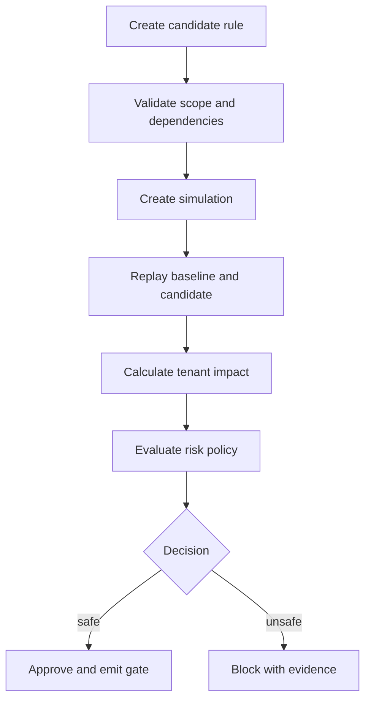

# RuleTwin — Complete Implementation Runbook

## 1. Product boundary

RuleTwin predicts the tenant-specific effect of a proposed business-rule/configuration change before release. It replays versioned synthetic events through current and candidate rules, compares outcomes, applies risk policy, and produces reproducible approval evidence.

It is not a billing product, no-code rules platform, production payment system, feature-flag service, or AI rule generator.

### Primary users

- Product owner: understands affected workflows and impact.
- Configuration analyst: authors candidate versions and inspects dependencies.
- QA lead: selects risk-based regression scenarios.
- Release manager: accepts or blocks a change based on evidence.
- Auditor: reproduces a release decision from immutable versions.

### v1 critical workflow

## 2. Technical baseline

- React + TypeScript + Vite frontend.
- FastAPI modular-monolith API.
- Separate Python worker process using shared application/domain packages.
- PostgreSQL for transactional state, JSONB inputs/results where bounded.
- Filesystem/MinIO for large result artifacts.
- PostgreSQL outbox plus worker polling; no Kafka/Celery in v1.
- OpenTelemetry, Prometheus, Grafana.
- Docker Compose with `core` and `observability` profiles.

Modules: identity, tenancy, rule catalog, datasets, simulation, impact, risk policy, approval, release gate, audit, operations.

## 3. Phase 0 — Charter and evidence

### Work

1. Write the one-page charter: problem, users, value hypothesis, v1 outcome, constraints, non-goals.
2. Map the current change-review workflow and desired RuleTwin workflow.
3. Conduct or simulate five structured discovery interviews using distinct roles. Label simulated evidence honestly.
4. Define top jobs-to-be-done and failure consequences.
5. Establish measures:
   - false-safe rate;
   - impact precision/recall;
   - deterministic replay rate;
   - proposal-to-decision time;
   - reviewer override rate;
   - P95 simulation time.
6. Create assumptions and risk register.
7. Define five rule types for v1: rounding, tiered rate, late fee, effective-date eligibility, exception routing.
8. Define three tenant configurations and the signature scenario.

### Artifacts

`charter.md`, `problem-brief.md`, `journey-current.md`, `journey-future.md`, `prd.md`, `metrics.md`, `risk-register.md`, synthetic-domain notice.

### Exit gate

- Problem and user are specific.
- One measurable critical workflow exists.
- Non-goals prevent accidental billing-platform scope.
- Synthetic data can demonstrate tenant differences without employer information.
- At least three assumptions have falsification tests.

## 4. Phase 1 — Requirements, model, architecture, and threats

### Functional requirements

- Create immutable rule versions from validated JSON.
- Model effective date, tenant scope, dependencies, author, and checksum.
- Create deterministic replay datasets from a seed and generator version.
- Run baseline and candidate in isolated execution contexts.
- Compare financial amount, workflow state, error, emitted events, and latency.
- Aggregate deltas by tenant, rule, scenario, and consequence.
- Apply versioned risk policy.
- Enforce author/reviewer/approver separation.
- Emit immutable release-gate outcome and auditable evidence tuple.
- Reproduce a prior result using engine, rule, dataset, and policy versions.

### NFR hypotheses

- Three tenants and 100,000 events on the reference laptop.
- Simulation acknowledgement P95 below 750 ms.
- 10,000-event replay completes within a measured target set after baseline.
- Same version tuple produces identical canonical outcome checksum.
- Zero cross-tenant access across the complete authorization matrix.
- Worker crash does not lose an acknowledged simulation.
- Duplicate create with the same idempotency key returns the same simulation.
- Audit completeness is 100% for protected mutations.

### Data model

Core tables:

- `tenants`, `users`, `roles`, `user_tenant_roles`;
- `rule_definitions`, `rule_versions`, `rule_dependencies`;
- `dataset_manifests`, `business_events`, `artifact_references`;
- `simulations`, `simulation_runs`, `outcomes`, `impact_deltas`;
- `risk_policies`, `risk_evaluations`;
- `approvals`, `release_gates`, `audit_events`, `outbox_events`.

Critical constraints:

- Versions are immutable.
- Effective-date ranges for the same tenant/rule cannot overlap unless explicitly allowed by rule type.
- Candidate cannot depend on a missing/incompatible version.
- Approval references an exact result checksum and policy version.
- An approval becomes stale when referenced evidence changes.
- Audit events cannot be updated/deleted by the application role.

### APIs to specify before implementation

- `POST /v1/tenants/{tenant_id}/rule-versions`
- `GET /v1/rule-versions/{version_id}`
- `GET /v1/rule-versions/{version_id}/diff`
- `POST /v1/replay-datasets`
- `POST /v1/simulations`
- `GET /v1/simulations/{simulation_id}`
- `GET /v1/simulations/{simulation_id}/impact`
- `POST /v1/simulations/{simulation_id}/approvals`
- `POST /v1/release-gates/evaluate`
- `GET /v1/audit-events`

Standard mutation behavior: `Idempotency-Key`, correlation ID, stable error object, `ETag`/version for concurrency-sensitive records, `202` for async simulation, `409` for stale/conflicting state, `422` for domain validation.

### ADRs required

1. Modular monolith versus microservices.
2. PostgreSQL outbox versus broker.
3. Shared-schema multitenancy versus database-per-tenant.
4. Relational dependency edges versus graph database.
5. JSON rule representation and deterministic interpreter versus executable user code.
6. Result storage/retention split between database and artifacts.
7. Hard block versus warning-only release gate.
8. Local JWT/RBAC and enterprise OIDC evolution.

### Threat model priorities

- Cross-tenant object access.
- Malicious or pathological rule causing resource exhaustion.
- Rule injection or execution of arbitrary code.
- Approval replay, self-approval, or evidence substitution.
- Dataset tampering.
- Audit deletion or log forgery.
- Denial of service through large simulations.
- Leakage through exports, logs, metrics, or predictable identifiers.

### Exit gate

OpenAPI validates, schema diagram is reviewed, eight ADRs exist, all high threats have planned controls and tests, and the signature workflow is traceable from UI to data.

## 5. Phase 2 — Engineering foundation deployment

### PR sequence

1. `chore/RT-001-repository-bootstrap`: tree, license, contribution/security docs, PR templates.
2. `chore/RT-002-quality-tooling`: Ruff, mypy/pyright, pytest, ESLint, Prettier, Vitest.
3. `feat/RT-003-local-platform`: PostgreSQL, API, web, worker Compose services and health checks.
4. `feat/RT-004-database-baseline`: migrations, application/test roles, seed command.
5. `feat/RT-005-observability-baseline`: structured logs, trace IDs, baseline metrics.
6. `ci/RT-006-ci-pipeline`: lint, type, tests, migration, build, scans.

### Implementation

- `/health/live`, `/health/ready`, version endpoint.
- Configuration validation at startup; fail closed when required values are absent.
- Request ID and trace middleware.
- Problem-details error contract.
- Transaction and repository scaffolding.
- Worker heartbeat and outbox poller skeleton.
- Deterministic seed command.
- Minimal UI shell showing service readiness and signed-in synthetic user.

### Tests

- Clean database migration up/down/forward policy.
- Service readiness when database is healthy/unhealthy.
- API error mapping.
- Worker claims one outbox item safely.
- Container runs as non-root.
- Secret scanner rejects a planted test secret in a controlled fixture.

### Deployment 1: `v0.1.0-dev-foundation`

Deploy to `dev`; no product claim. Record clean-clone startup time and hardware.

### Exit gate

One command starts core services; one command runs checks; CI builds from a clean runner; health and telemetry are visible.

## 6. Phase 3 — First vertical slice

Scope: one tenant, one rounding rule, 100 deterministic events, one author and approver, baseline-versus-candidate simulation, impact page, allow/block result.

### Implementation order

1. Rule schema, canonicalization, checksum, immutable version aggregate.
2. Safe deterministic rule interpreter with allowlisted operators; never evaluate arbitrary Python/JavaScript.
3. Dataset manifest, seeded event generator, checksum.
4. Simulation aggregate and state machine: `requested -> queued -> running -> completed|failed|cancelled`.
5. Transactional simulation creation plus outbox record.
6. Worker leasing, heartbeat, idempotent execution, result checksum.
7. Baseline/candidate outcome comparator.
8. Simple risk policy: block when financial delta exceeds threshold.
9. Approval bound to simulation and result checksum.
10. UI: propose rule, select dataset, start simulation, poll status, inspect delta, decide.
11. Audit events at every state transition.

### Required tests

- Rule canonicalization is order-independent.
- Property tests for rounding boundaries and money precision.
- Duplicate simulation request is idempotent.
- Worker crash after claim and after result write is recoverable.
- Same version tuple yields same output checksum.
- Approval of incomplete/stale/self-authored evidence fails.
- UI critical flow passes in Playwright.

### Deployment 2: `v0.2.0-alpha-slice`

Deploy to staging using a versioned scenario pack. Demonstrate the complete workflow.

### Exit gate

The signature path works end-to-end; no manual database changes; all evidence is reproducible from IDs shown in the UI.

## 7. Phase 4 — Complete MVP

### Capability increments

1. Multi-tenant RBAC and object-level authorization.
2. Five rule types and effective-date validation.
3. Dependency graph, cycle detection, and affected-scenario selection.
4. Three tenants and versioned scenario generator.
5. Delta dimensions: amount, state, error, events, latency.
6. Risk policy versions with thresholds by consequence and tenant tier.
7. Reviewer/approver workflows, rejection reason, approval expiry.
8. Mock deployment webhook with signed payload, retry, and dead-letter status.
9. Auditor read-only reproduction and evidence export.
10. Filtering, pagination, accessible tables, empty/partial/failure UI states.

### API/data details

- Cursor pagination for audit and large impact lists.
- Signed artifact download with short local validity design.
- Webhook HMAC signature, timestamp, event ID, retry schedule.
- Store summary deltas relationally; large raw outcomes as compressed artifacts with checksums.
- Preserve money as integer minor units or exact decimal; document choice.
- Impact selection must over-include when uncertain; a false-positive warning is safer than a false-safe omission.

### Tests

- Full role-action matrix.
- Tenant A ID cannot be accessed by Tenant B through path, filter, export, artifact, metrics, or webhook.
- Dependency cycle and missing dependency.
- Boundary dates, leap day, timezone input normalization.
- Large result pagination and export limits.
- Webhook timeout, duplicate delivery, invalid signature.

### Deployment 3: `v0.5.0-alpha-mvp`

Feature-complete alpha. Invite structured usability review using scripted tasks.

### Exit gate

All v1 functional requirements work; top usability problems are recorded; no critical authorization gap.

## 8. Phase 5 — Security and failure hardening

### Controls

- Tenant-scoped repository methods require authenticated tenant context.
- Optional PostgreSQL row-level security defense-in-depth experiment, documented in ADR.
- Strict rule JSON schema, nesting/operator/size limits, execution time and event budgets.
- Worker executes rules in a constrained deterministic interpreter.
- Proposal/approval separation and recent-evidence binding.
- Rate limits on simulation creation, exports, and authentication.
- Immutable audit hash chain or periodic digest experiment; document limitations.
- Artifact authorization rechecked at download.
- Log redaction tests.
- Backup encryption design; local file permissions for portfolio implementation.

### Failure drills

- API dies after transaction commit before response.
- Worker dies mid-run and lease expires.
- PostgreSQL restarts during polling.
- Artifact write succeeds but database finalize fails and vice versa.
- Rule engine timeout.
- Risk policy unavailable or invalid: gate fails closed.
- Approval becomes stale after policy/result change.
- Webhook unavailable for all retries.

### Deployment 4: `v0.7.0-beta-hardened`

### Exit gate

Threat controls are verified, complete tenant-isolation suite passes, failure states are operator-visible, and no failure is reported as success.

## 9. Phase 6 — Evaluation, performance, and observability

### Evaluation corpus

At least 40 controlled changes:

- 8 safe/no-effect;
- 8 tenant-isolated;
- 6 dependency/cross-rule;
- 6 date-boundary;
- 4 rounding/precision;
- 4 missing/malformed data;
- 4 dangerous changes that must block.

Each fixture contains expected affected tenants/scenarios, expected delta class, expected policy outcome, and rationale.

### Metrics and gates

- False-safe rate: **0 on dangerous release set**.
- Affected-scenario recall: target >= 0.98.
- Precision: report, optimize after recall.
- Replay determinism: 100% on identical version tuples.
- Tenant isolation: 100% pass.
- Audit completeness: 100% for protected transitions.
- P50/P95 duration and throughput at 1k, 10k, 100k events.
- Queue age, claim retries, dead-letter count, artifact size, DB growth.

### Load profiles

1. Normal: one analyst, one 10k simulation.
2. Burst: 20 queued simulations across tenants.
3. Noisy tenant: one large run while small tenants submit work.
4. Endurance: repeated runs for two hours with memory/disk tracking.

Implement per-tenant concurrency limits and fair job selection if noisy-neighbor evidence warrants it.

### Dashboards

- API health and latency.
- Simulation lifecycle/failures/queue age.
- Risk outcomes and reviewer overrides.
- Worker/database/resource saturation.
- Audit emission and webhook delivery.

### Exit gate

Versioned evaluation report passes thresholds; performance bottleneck and scale evolution are documented; alerts link to runbooks.

## 10. Phase 7 — Release candidate operations

### Work

- Freeze v1 contract and generate API documentation.
- Test upgrade from previous tagged schema and seed version.
- Script backup, restore, index rebuild, dead-letter replay, stuck-job recovery.
- Create runbooks for API outage, queue growth, failed simulation, storage full, database recovery, stale approval, webhook failure, suspected tenant leak.
- Rehearse rollback with recorded timings.
- Produce SBOM, image scan, checksums, release notes.
- Complete accessibility, browser, and clean-machine validation.
- Review licenses for every dependency and seed asset.

### Deployment 5: `v1.0.0-rc.1`

Deploy exact candidate images to staging and do not rebuild for final promotion.

### Exit gate

Handbook release checklist passes; no S0/S1/S2 issue without explicit justified acceptance; restore and rollback rehearsals succeed.

## 11. Phase 8 — Local production release

### Deployment 6: `v1.0.0`

- Promote RC image digests.
- Apply migration with preflight and backup.
- Run smoke simulation and checksum verification.
- Verify dashboards, audit events, and webhook.
- Record deployment evidence and post-deploy review.
- Tag scenario pack and evaluation report.

Rollback if migration, critical workflow, isolation, audit, or determinism checks fail.

## 12. Phase 9 — Portfolio proof

- README: problem, signature benchmark, architecture, three hard decisions, failure behavior, quick start.
- Five-minute demo: propose, simulate, show tenant difference, block, reproduce.
- Case study: discovery, scope, alternatives, evolution, measurements, limitations.
- Cost model: laptop hours, energy estimate, storage/compute per 10k events, cloud evolution estimate clearly labeled.
- Roadmap: cancellation, richer policies, scenario minimization, service extraction triggers, OIDC, object store.
- Defense answers: false-safe risk, determinism, tenant model, async choice, graph choice, audit integrity, scale boundary, build versus buy.

## 13. RuleTwin production-readiness checklist

- [ ] Arbitrary code cannot execute from rule input.
- [ ] Money/date behavior has property and boundary tests.
- [ ] Every tenant-owned query is isolation-tested.
- [ ] Simulation creation and worker execution are idempotent.
- [ ] Approval is tied to exact immutable evidence.
- [ ] Risk evaluation fails closed.
- [ ] Raw and summarized results have retention rules.
- [ ] Backups have been restored.
- [ ] SLOs and evaluation gates are measured on named hardware.
- [ ] The exact released version reproduces the signature demo.

