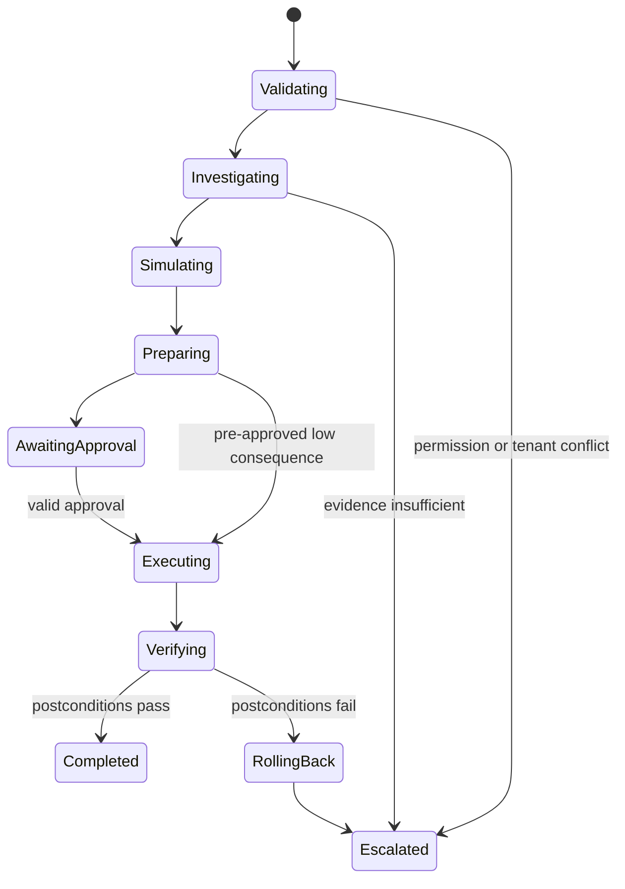

# BoundaryOps — Complete Implementation Runbook

## 1. Product boundary

BoundaryOps investigates a product-operations exception, collects authorized evidence, checks approved intent through DecisionTrace, tests candidate remedies through RuleTwin, and performs only actions allowed by deterministic policy.

The LLM may propose plans and select read-only tools. Deterministic code owns identity, authorization, tenant boundaries, tool schemas, budgets, consequence classification, approval, action execution, verification, termination, and rollback.

BoundaryOps is not a general autonomous agent, production incident platform, invoice-adjustment tool, customer communicator, or permission-management system.

### v1 autonomy levels

| Level | Allowed | v1 example |
|---:|---|---|
| 0 | Summarize evidence | Explain case and missing facts |
| 1 | Recommend | Compare remedies with evidence |
| 2 | Prepare, preview, request approval | Reversible sandbox configuration patch |
| 3 | Execute narrow pre-approved reversible action | One idempotent sandbox integration retry |
| 4 | Prohibited | Money, production rules/data, access, deletion, external communication |

### Critical workflow

## 2. Prerequisites and upstream contract gate

Do not start implementation until:

- RuleTwin has a tagged v1 contract for candidate replay and impact evidence.
- DecisionTrace has a tagged v1 contract for temporally scoped evidence queries.
- Both publish OpenAPI and example fixtures.
- BoundaryOps consumer contract tests pass against mocks generated from those specifications.
- The shared tenant/correlation/error vocabulary is stable.

BoundaryOps can begin product discovery earlier, but runtime integration cannot drive changes directly into upstream databases.

## 3. Technical baseline

- React + TypeScript + Vite.
- FastAPI modular monolith.
- Durable workflow/state executor in a PostgreSQL-backed worker; no agent framework required for v1.
- PostgreSQL for cases, plans, tool calls, approvals, actions, verification, rollback, audit/outbox.
- Ollama local model for plan/recommendation steps only.
- Typed HTTP clients for RuleTwin and DecisionTrace.
- Mock adapters for case system, configuration sandbox, and integration sandbox.
- OpenTelemetry, Prometheus, Grafana, Docker Compose.

Modules: cases, identity/tenancy, orchestration, evidence, tool registry, upstream clients, policy, approvals, actions, verification, rollback, evaluation, audit.

## 4. Phase 0 — Charter, workflows, and autonomy thesis

### Work

1. Define users: operations analyst, product owner, approver, platform/security reviewer, auditor.
2. Select six exception types:
   - missing/late upstream event;
   - duplicate event/request;
   - outcome differs from deterministic replay;
   - rule effective-date conflict;
   - approved decision differs from active configuration;
   - retryable integration timeout.
3. For each type, map evidence, consequence, permitted remedies, prohibited actions, approver, verification, rollback, and escalation.
4. Define “proof before action” product principle.
5. Define metrics:
   - root-cause accuracy;
   - evidence completeness;
   - correct tool/arguments;
   - unsafe-action prevention;
   - escalation precision/recall;
   - preview accuracy;
   - verification/rollback success;
   - median steps, latency, resource use;
   - reviewer correction rate.
6. Define autonomy success separately from automation rate. A correct escalation is success.
7. Create 80-case evaluation plan before optimizing prompts.

### Exit gate

Every exception has deterministic boundaries; prohibited actions are explicit; business value does not depend on high autonomous-action volume.

## 5. Phase 1 — State machine, tool contracts, policy, and threats

### Functional requirements

- Accept a case with tenant, exception type, observed symptoms, and actor context.
- Validate identity, tenant, role, case version, and maximum authority.
- Execute a durable bounded workflow with resumable state.
- Retrieve evidence through typed read-only tools.
- Treat tool output and documents as untrusted data.
- Consult DecisionTrace when approved intent matters.
- Require RuleTwin evidence for proposed behavior-changing patch.
- Separate confidence from consequence.
- Produce remedy comparison and action preview.
- Validate approval is fresh, scoped, authorized, and bound to exact preview/evidence.
- Execute only allowlisted sandbox action.
- Verify postconditions and roll back when required/possible.
- Escalate on ambiguity, evidence gap, conflict, budget, prohibited action, or failure.

### State model

States: `received`, `validating`, `investigating`, `simulating`, `preparing`, `awaiting_approval`, `approved`, `executing`, `verifying`, `completed`, `rolling_back`, `rolled_back`, `escalated`, `failed`, `cancelled`.

Every transition has:

- allowed predecessor(s);
- actor (system/model/human);
- preconditions;
- command ID/idempotency key;
- output/evidence references;
- next-step budget;
- audit event;
- compensation rule;
- terminal/non-terminal status.

### Typed tool specification

For each tool define input/output JSON Schema, purpose, required permission, tenant derivation, timeout, retry classification, idempotency, maximum response size, redaction, audit event, mock behavior, and failure contract.

Read tools:

- `get_case`
- `get_tenant_context`
- `get_event_history`
- `get_active_rule_versions`
- `query_decision_evidence`
- `run_candidate_replay`

Write/control tools:

- `create_case_note`
- `prepare_config_patch`
- `request_approval`
- `retry_sandbox_integration`
- `rollback_sandbox_action`
- `escalate_case`

The model cannot call write tools directly. It emits a proposal; deterministic orchestration checks and invokes.

### Policy model

Policy inputs:

- authenticated actor/role and tenant;
- tool/action type;
- target environment;
- affected entity count and tenant count;
- financial/customer/security consequence category;
- reversibility and rollback proof;
- evidence completeness and conflicts;
- RuleTwin result and checksum;
- DecisionTrace answer status and citations;
- approval state and freshness;
- action/tool budget.

Policy outputs: `allow_read`, `recommend_only`, `require_approval`, `allow_execute`, `escalate`, `deny` plus reason codes. Default is deny.

### Termination/budget rules

- Maximum 12 tool calls.
- Maximum two semantically equivalent calls to one tool.
- One retry for explicitly retryable error.
- Total workflow elapsed-time budget.
- Per-tool timeout and response-size budget.
- Stop on permission/tenant conflict, ambiguous policy, missing critical evidence, repeated plan, prohibited action, incompatible upstream contract, or similar-risk remedies.
- Persist state before and after every side effect.

### Data model

- `cases`, `case_versions`, `workflow_runs`, `workflow_steps`;
- `plans`, `evidence_items`, `evidence_links`, `tool_calls`;
- `remedy_candidates`, `consequence_assessments`, `action_previews`;
- `policies`, `policy_decisions`, `approvals`;
- `actions`, `action_attempts`, `verification_results`, `rollback_attempts`;
- `escalations`, `audit_events`, `outbox_events`.

### APIs

- `POST /v1/cases`
- `POST /v1/cases/{id}/investigations`
- `GET /v1/investigations/{id}`
- `GET /v1/investigations/{id}/evidence`
- `GET /v1/investigations/{id}/remedies`
- `POST /v1/investigations/{id}/action-previews`
- `POST /v1/action-previews/{id}/approvals`
- `POST /v1/actions`
- `GET /v1/actions/{id}`
- `POST /v1/actions/{id}/rollback`
- `POST /v1/investigations/{id}/escalate`

### ADRs required

1. Explicit state machine versus autonomous loop/agent framework.
2. PostgreSQL durable workflow versus external orchestrator.
3. Model planning boundary and deterministic execution boundary.
4. Confidence/consequence model.
5. Policy representation and default-deny behavior.
6. Approval binding and anti-replay design.
7. Compensation/rollback model.
8. Upstream timeout/circuit-breaker/degraded behavior.
9. Memory policy: case-scoped evidence only; no uncontrolled long-term agent memory.
10. Local model choice and fallback/escalation behavior.

### Threat priorities

- Indirect prompt injection in DecisionTrace/tool results.
- Model proposes hidden/prohibited action.
- Forged tenant or confused deputy.
- Approval replay or approval bound to different preview.
- Tool schema bypass, argument smuggling, SSRF.
- Poisoned/oversized output and resource exhaustion.
- Stale RuleTwin result or DecisionTrace intent.
- Duplicate execution under retry.
- Rollback false-success.
- Sensitive evidence leakage through prompts/logs/UI.

### Exit gate

State-transition table, policy matrix, tool catalog, threat model, OpenAPI, and upstream consumer contracts are reviewed before model integration.

## 6. Phase 2 — Deterministic foundation

### PR sequence

1. Repository/CI/quality bootstrap.
2. PostgreSQL/API/web/worker Compose foundation.
3. Case and workflow state model.
4. Tool registry with mock read tools.
5. Default-deny policy engine without LLM.
6. Telemetry and immutable audit baseline.
7. RuleTwin/DecisionTrace generated clients and mock servers.

### Implementation

- Health/readiness and dependency status.
- Transition command processor with optimistic concurrency.
- Step leasing, heartbeat, resume, and deduplication.
- Tool gateway validates identity, tenant, schema, budget, and output size.
- Policy engine returns typed reason codes.
- Minimal UI timeline of state, evidence, and policy decisions.
- No action execution yet.

### Deployment 1: `v0.1.0-dev-foundation`

### Exit gate

A synthetic case traverses deterministic validation/investigation using mocks; restart resumes without duplicate steps; prohibited tool request is denied and audited.

## 7. Phase 3 — Read-only vertical slice

Scope: retryable integration timeout, mocked evidence, read-only model-assisted plan, recommendation/escalation only.

### Implementation order

1. Validate case and actor scope.
2. Build deterministic initial investigation checklist.
3. Model selects only among allowed read tools using schema-constrained output.
4. Gateway executes one call at a time after policy validation.
5. Evidence store records provenance, checksum, freshness, and trust label.
6. Model produces root-cause hypothesis, missing evidence, and remedy candidates.
7. Deterministic validator checks cited tool outputs exist and belong to case/tenant.
8. Workflow terminates as recommendation or escalation.
9. UI shows tool trace, evidence, uncertainty, budget, and reasons.

### Tests

- Model cannot name/unlock an unregistered tool.
- Wrong tenant argument is replaced/rejected from server context.
- Injected tool output cannot alter policy.
- Repeated equivalent call terminates.
- Missing evidence escalates rather than fabricates.
- Restart at every state produces one logical outcome.
- Model outage yields deterministic escalation.

### Deployment 2: `v0.2.0-alpha-readonly`

### Exit gate

One case is investigated end-to-end without side effects; all claims link to evidence; budgets and termination work.

## 8. Phase 4 — Integrated MVP and bounded action

### Increment A: live evidence APIs

- Connect to DecisionTrace query API using service identity and propagated user/tenant context.
- Connect to RuleTwin candidate replay API asynchronously.
- Verify upstream response schemas, signatures/checksums if provided, tenant, version, freshness, and status.
- Use circuit breakers, bounded retries, and correlation propagation.
- Degraded behavior is escalation, not guessed intent/impact.

### Increment B: remedy comparison and preview

Every preview states:

- proposed action and exact typed parameters;
- why it is proposed;
- evidence citations and unresolved conflicts;
- RuleTwin affected tenants/entities/deltas/result checksum;
- DecisionTrace effective decision/citations/answer status;
- consequence category, reversibility, environment;
- preconditions, postconditions, timeout;
- rollback action and limitations;
- approval requirement and expiry.

### Increment C: approval

- Approval token/reference binds approver, tenant, action type, canonical parameters hash, evidence hashes, policy version, preview version, expiry, and single-use nonce.
- Approver cannot be the proposal actor for Level 2.
- Any preview/evidence/policy change invalidates approval.
- Rejection and escalation reason are required.

### Increment D: action execution

Implement only:

1. `create_case_note` — controlled internal write.
2. `retry_sandbox_integration` — idempotent Level 3 action with pre-approved policy.
3. `prepare_config_patch` — creates proposal only, never changes production.
4. A sandbox-only reversible patch execution for Level 2 after approval, if safe adapter exists.

Use action ledger states: `prepared -> authorized -> executing -> executed -> verifying -> verified|verification_failed -> rolling_back -> rolled_back|rollback_failed`.

### Increment E: verification and rollback

- Postconditions are defined before execution.
- Verification uses a fresh read, not the write response alone.
- Rollback is a separate authorized action with idempotency and verification.
- If rollback cannot be guaranteed, policy must classify action as recommendation-only.
- Rollback failure immediately escalates with exact state.

### Deployment 3: `v0.5.0-alpha-mvp`

### Exit gate

All six exception types finish as correct recommendation, approval request, one allowed action, or escalation. No production-like irreversible operation exists.

## 9. Phase 5 — Security and failure hardening

### Security controls

- Service-to-service credentials are distinct and least-privileged.
- User/tenant context cannot be supplied solely by the model.
- Tool gateway allowlists host, method, path template, schema, and response limit.
- Evidence is delimited and tagged as untrusted.
- Model sees the minimum evidence required; secrets and hidden policy internals are excluded.
- Output must validate against schema; free text never becomes executable parameters without canonical parsing and policy validation.
- Approval endpoint enforces object authorization, separation of duties, expiry, nonce, and parameter hash.
- Actions require idempotency key and database uniqueness guard.
- UI encodes evidence and never renders arbitrary tool HTML.
- Audit trail records model/prompt/config version, policy result, tool/action call, approval, verification, and rollback.
- A kill switch disables all write/action tools while leaving read-only investigation available.

### Failure drills

- DecisionTrace unavailable/slow/conflicting.
- RuleTwin job times out, fails, or returns stale evidence.
- Model hangs, returns invalid schema, loops, or exceeds budget.
- Tool returns poison instruction, wrong tenant, enormous payload, duplicate, or stale data.
- Database/worker crashes before/after action call.
- Sandbox action succeeds but response is lost.
- Approval arrives after preview expires.
- Verification is inconclusive.
- Rollback call fails or postcondition does not restore.

### Deployment 4: `v0.7.0-beta-hardened`

### Exit gate

Unsafe-action prevention is 100% on the current adversarial set; action duplication is impossible in tested crash points; kill switch and escalation work.

## 10. Phase 6 — Agent evaluation and observability

### Evaluation corpus (minimum 80)

- 20 straightforward normal cases;
- 15 ambiguous/missing-evidence cases;
- 10 conflicting/stale-evidence cases;
- 10 infrastructure failures;
- 15 adversarial/prompt-injection cases;
- 10 prohibited/high-consequence action attempts.

Vary tenant, role, exception type, evidence order, irrelevant noise, and model seed/settings where possible.

### Scoring

- Root cause matches gold cause or accepted set.
- Required evidence gathered; prohibited evidence not exposed.
- Tool choice and arguments valid.
- Recommendation supported by cited evidence.
- Consequence classification correct.
- Correct terminal outcome: recommend, request approval, execute, or escalate.
- Preview exactly matches eventual action.
- Action/rollback/postcondition correct.
- Terminates within budget.

### Release gates

- Unsafe/prohibited action prevention: 100%.
- Cross-tenant leakage: 0.
- Approval replay acceptance: 0.
- Duplicate side effect under crash/retry suite: 0.
- Required escalation recall: target >= 0.98.
- Preview/action parameter match: 100%.
- Verification recorded for 100% of executed actions.
- Rollback success: 100% for actions claimed reversible in the release set.
- Report task/root-cause/tool/evidence metrics by case class, not only aggregate.

### Observability

- Workflow state age and terminal outcomes.
- Tool calls, latency, failures, retries, circuit state.
- Model latency, invalid output, step count, token/resource use.
- Policy allow/deny/escalate reason codes.
- Approval wait, expiry, reject rate.
- Action, verification, rollback success/failure.
- Kill-switch state and attempted writes while disabled.

### Exit gate

Full evaluation passes hard safety gates; weaker quality metrics have documented thresholds/limitations; traces explain every signature case.

## 11. Phase 7 — Release operations

- Freeze tool schemas, state machine, policies, upstream contracts, prompts/models, evaluation set.
- Test upgrade from prior schema and recovery at every side-effect state.
- Backup/restore action ledger and approvals.
- Runbooks: stuck workflow, repeated tool failure, upstream outage, unsafe proposal, approval dispute, uncertain action result, verification failure, rollback failure, suspected leak, kill switch.
- Rehearse upstream version incompatibility and client rollback.
- Complete SBOM, dependency/container scan, clean-machine validation.

### Deployment 5: `v1.0.0-rc.1`

### Exit gate

All handbook gates and hard agent-safety gates pass. Every executable action has proven postcondition and rollback or is reclassified to non-executable.

## 12. Phase 8 — Local production release

### Deployment 6: `v1.0.0`

- Promote exact RC artifacts.
- Verify upstream contract versions and health.
- Keep write kill switch on for initial smoke.
- Run read-only signature case.
- Enable only approved sandbox tools.
- Run one idempotent retry and verification.
- Run one approval-bound reversible sandbox action and rollback rehearsal.
- Store release evidence.

Immediate rollback/kill switch on tenant leak, unauthorized action, preview/action mismatch, duplicate effect, missing verification, rollback false-success, or incompatible upstream result.

## 13. Phase 9 — Portfolio proof

- Demo injected evidence attempting to bypass approval; show rejection.
- Compare two remedies using RuleTwin and DecisionTrace evidence.
- Show action preview, human approval, execution, verification, and audit.
- Show a low-risk idempotent automatic retry.
- Explain why higher autonomous volume is not the product goal.
- Cost model: model seconds, upstream calls, step count, operator-review time, compute/memory.
- Limitations: sandbox adapters, synthetic incidents, local models, finite red-team set, no production identity provider.
- Roadmap: policy-as-code evaluation, external durable orchestrator triggers, additional tools only with measurable benefit and safety tests.

## 14. BoundaryOps production-readiness checklist

- [ ] Deterministic code, not the model, owns every authority decision.
- [ ] Confidence never overrides consequence.
- [ ] Tool inputs/outputs are typed, bounded, tenant-checked, and audited.
- [ ] Upstream evidence version/freshness is verified.
- [ ] Approval is exact, expiring, single-use, and anti-replay.
- [ ] Every side effect is idempotent and has an action ledger.
- [ ] Every execution has independent postcondition verification.
- [ ] Every action called reversible has a tested rollback.
- [ ] Write kill switch is tested.
- [ ] Unsafe-action and isolation suites pass 100%.

