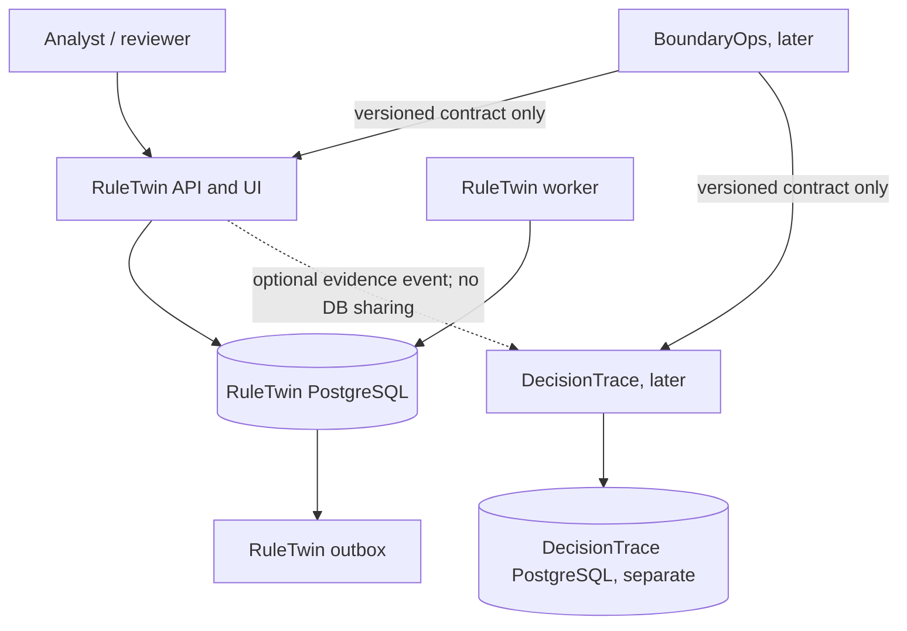

# Portfolio System Context and Boundaries

## Context

NovaBill is a fictional shared multi-tenant contract-to-cash/utility-billing environment. Shared application code does not imply shared tenant rules, contracts, or data. This portfolio builds review/investigation support around that fictional environment; it is not a billing engine and has no production customer connection.

## Product ownership

| Product | Owns | Does not own |
|---|---|---|
| RuleTwin (first) | Immutable rule versions, synthetic replay datasets, simulation jobs/results, impact, deterministic risk evaluations, approvals/gates, audit. | Billing execution, production writes, another product's data store. |
| DecisionTrace (later) | Versioned evidence, temporal decisions, relationships, authorized retrieval and drift. | RuleTwin database or autonomous production actions. |
| BoundaryOps (later) | Exception workflows, typed tool calls, policy/approval/action ledger, verification and rollback evidence. | Upstream databases or authority decisions delegated to a model. |

BoundaryOps may call only versioned RuleTwin and DecisionTrace APIs/contracts, never internal packages or databases. It must be mock-tested against both contracts before runtime integration. DecisionTrace does not start until RuleTwin has a tagged local production v1 under the required sequence.

## Future product flow

This diagram describes target boundaries, not deployed components. There is currently no runtime.

## Trust/security boundaries

- Browser requests are untrusted. Authentication context, roles, and tenant scope are established and checked server-side.
- Rule JSON, event fixtures, imported artifacts, and model/text outputs (in later products) are untrusted data.
- API, worker, PostgreSQL, artifact storage, and any upstream service have separate identities and bounded interfaces.
- No client-supplied tenant ID alone grants access. Every lookup/mutation/export/job is tenant-scoped and object-authorized.
- Rule execution is a deterministic allowlisted interpreter, never eval/exec or user-supplied scripts.
- A future BoundaryOps model may suggest/read, but deterministic controls own authorization, budgets, approvals, execution, verification, rollback, and termination.

## Data flow target

1. Authenticated analyst submits a schema-validated, tenant-scoped candidate plus idempotency/correlation IDs.
2. API applies authorization, validation, resource limits, and transactionally stores immutable inputs, simulation state, and outbox record.
3. Worker claims an event with a lease, loads only authorized versioned inputs, runs deterministic baseline and candidate evaluation, and stores checksummed results.
4. Risk policy evaluates exact result/policy version; missing/invalid evidence fails closed.
5. Reviewer inspects bounded tenant-scoped impact; approval is bound to exact evidence and separated from proposal author.
6. Append-only audit records protected transitions. Reproducibility uses engine, rule, dataset, and policy versions/checksums.

## Planned stack (not installed or implemented)

React/TypeScript/Vite web; Python/FastAPI modular monolith API and separate worker process; PostgreSQL; transactional outbox polling without managed broker; Docker Compose locally. OpenAPI synchronous contracts, JSON Schema event contracts. Storage for large artifacts and observability profiles are Phase 1/2 choices; do not pretend they are configured.
